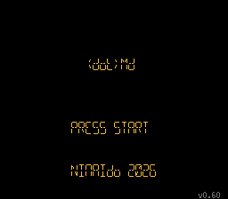
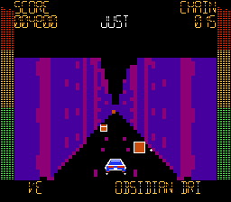

# (dot)md — ドット・エムディー

音楽に合わせてキューブを集め、コーナーを曲がる、1人用のドットイート・リズムドライブゲームです。ファミリーコンピュータ ディスクシステム向けのFDS形式で配布します。

**v0.60 · 6曲収録 · EASY／HARD · RANDOM対応**

 

## ダウンロード

**[DOTMD-v0.60.zipをダウンロード](https://github.com/ric-op2/dotmd/releases/download/v0.60/DOTMD-v0.60.zip)** して展開してください。ゲーム本体 `DOTMD-v0.60-6SONGS.fds` と、取扱説明書、印刷用データ、起動・保存の補足、利用条件が入っています。

**[取扱説明書 PDF](docs/DOTMD-Booklet-88mm.pdf)** · [A4両面印刷用 PDF](docs/DOTMD-Booklet-A4-Duplex.pdf) · [起動と保存](docs/PLAYING.md) · [動作確認と制限](docs/COMPATIBILITY.md)

FDS対応エミュレーターなどの実行環境が別途必要です。エミュレーターとディスクシステムBIOSは同梱していません。FDSファイルを対応エミュレーターで開いてください。

## 遊びかた

十字ボタンで3車線・上下2段の位置を合わせ、近づいてくるキューブを取得します。コーナーは **Bで左折、Aで右折**。ゲージを残して曲の最後まで走ればCLEARです。

| 場面 | 操作 |
|---|---|
| タイトル | STARTで曲選択へ |
| 曲選択 | 左右で曲、SELECTでEASY／HARD、AでRANDOM切替、STARTで開始 |
| プレイ中 | 左右で車線移動、上で上段へ、Bで左折、Aで右折 |
| 結果・保存確認 | 左右で選び、AまたはSTARTで決定 |

左右を離すと中央車線へ、上を離すと下段へ戻ります。プレイ中にポーズはできません。

## 収録曲

| 曲名 | 演奏時間の目安 |
|---|---|
| NEON AFTERGLOW | 約2分 |
| REDLINE MIRAGE | 約2分8秒 |
| RYZYYYN | 約2分13秒 |
| CHROME POCKET | 約1分42秒 |
| OBSIDIAN DRIVE | 約1分52秒 |
| VELOCITY GHOST | 約1分36秒 |

## 紙の説明書

88mm角、表紙・裏表紙を含めて12ページ（本文1〜10ページ）です。A4用紙1枚を両面印刷して作れます。印刷設定は **A4縦・長辺とじ・100%**。詳しくは[印刷と製本](docs/PRINTING.txt)をご覧ください。

## v0.60の変更

キューブ取得時に小さな光を追加しました。JUSTでは大きく長く光ります。タイトル文字にも短い明るさの揺らぎを追加しました。[更新履歴](CHANGELOG.md)

## 動作確認

v0.60はFCEUmmで全6曲のEASY／HARD完走、ハイスコアの保存・非保存、リセット後の記録復元を確認しています。実機およびFDSKEYでのプレイ・保存は未確認です。[確認範囲の詳細](docs/COMPATIBILITY.md)

## 利用条件

**個人が非商用で無料プレイするための利用を許可します。** 再配布・改変・商用利用は許可していません。詳細と第三者コードの扱いは[利用条件](LICENSE.txt)および[第三者の権利表示](THIRD-PARTY-NOTICES.txt)を確認してください。

このリポジトリはゲームの配布・案内用です。ゲームのソースコードと譜面生成・編集機能は公開対象に含みません。

不具合はこのリポジトリのIssuesへ、ゲームの版、使用環境、曲名、難易度、再現手順を添えてお知らせください。

制作：NinAIdo 2026 · [クレジット](CREDITS.md)

本作は任天堂の公式製品ではありません。
