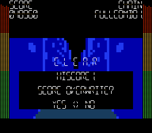

# Jev × (dot)md — HARD 全118判定 JUST

2026年9月20日のプレイ記録です。ゲームは **ブラウザ版 v0.60**、曲は **NEON AFTERGLOW / HARD**。

**[画面記録を再生する](https://ric-op2.github.io/dotmd/play-records/jev-hard-all-just/)**

| 項目 | 結果 |
|---|---:|
| 最終スコア | 48,960 |
| JUST | 118（キューブ109・コーナー9） |
| Good / MISS | 0 / 0 |
| 最大チェイン | 118 / FULLCOMBO |
| モデル | Jev-1.13.0 |
| モデル呼び出し | 118回 |

## 実行方法と読み取り方

画面に見えるスプライトの位置・段・矢印をコードで構造化し、Jev が移動先とコーナーの A/B を選択しました。推論中はエミュレーターを停止し、コードが事前に測定した JUST のタイミングで入力しました。同じ位置が連続するときは1フレームだけ位置を外して戻しています。

**一時停止とフレーム単位の入力補助を使ったプレイです。リアルタイム反応、Jev 単独の画像認識、人間と同条件での腕前を示すものではありません。** スコア・ゲージ・譜面・判定幅のメモリー値は変更していません。

JUST / Good / MISS の内訳は、チェインごとに安定した HUD スコアを読み、加点量から復元した値です。ゲーム画面そのものに全判定の集計が表示されるわけではありません。クリア時40,800点に結果画面のボーナス8,160点が加算され、最終48,960点です。

入力タイミングの調整後の2回目の試行を掲載しています。1回目はコーナーの警告時間が短い箇所で1 MISSでした。画面記録は約1秒間隔の静止画を順に表示するもので、音声はありません。

## ファイル

- [再生用HTML](index.html) — ダウンロードしてブラウザーでも開けます。
- [結果データ](jev-dotmd-summary.json)
- [まとめ画像](jev-dotmd-report.png)
- [設定画面](jev-dotmd-settings.png)

ゲーム制作：**NinAIdo** · [ゲームで遊ぶ](https://ric-op2.github.io/dotmd/) · [利用条件](https://github.com/ric-op2/dotmd/blob/main/LICENSE.txt)

この記録の掲載は、ゲーム本体・楽曲・画像等の一般的な再配布や商用利用の許可を意味しません。
